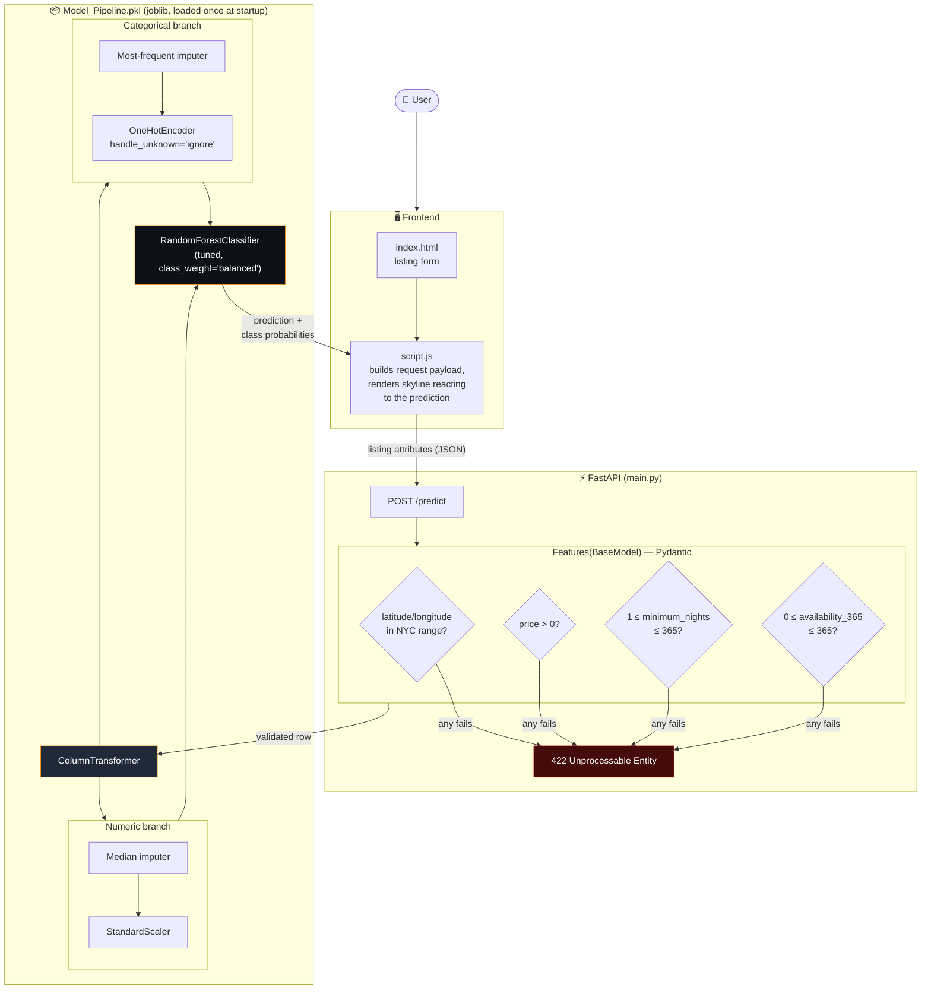
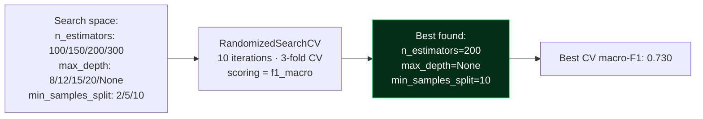
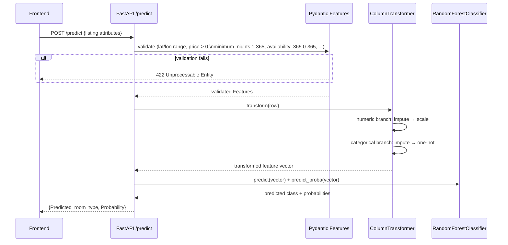

<div align="center">

# 🏙️ NYC Airbnb Room Type Predictor

### A FastAPI + scikit-learn app that predicts whether a listing is an Entire home/apt, Private room, or Shared room — from a single serialized pipeline, no manual preprocessing at inference time.


**48,895 NYC listings · 4 algorithms compared · 1 serialized Pipeline · 85.6% test accuracy, measured once and only once**

**Live demo:** https://nyc-airbnb-room-type-predictor.vercel.app/

</div>

---

## 📖 Table of Contents

- [What This Project Demonstrates](#what-this-project-demonstrates)
- [Architecture](#architecture)
- [Dataset](#dataset)
- [ML Pipeline — From Raw CSV to Served Model](#ml-pipeline--from-raw-csv-to-served-model)
- [Preprocessing](#preprocessing)
- [Model Comparison](#model-comparison)
- [Hyperparameter Tuning](#hyperparameter-tuning)
- [Final Test Performance](#final-test-performance)
- [Inference Flow](#inference-flow)
- [Screenshots](#screenshots)
- [API](#api)
- [Setup](#setup)
- [Tech Stack](#tech-stack)

---

## 🎯 What This Project Demonstrates

- Full ML lifecycle: EDA → cleaning → preprocessing pipeline → model comparison → hyperparameter tuning → deployment
- Honest model comparison across 4 algorithms using stratified cross-validation, not just picking one
- Handling real class imbalance (Shared Room is a small minority class) with `class_weight="balanced"` — and a documented reason for *not* using SMOTE instead
- A single serialized `Pipeline` (preprocessing + model together) so inference needs zero manual preprocessing
- A FastAPI backend with Pydantic field-level validation and a custom frontend

---

## 🏗️ Architecture



The entire preprocessing + model logic ships as a single serialized artifact — `main.py` contains no feature-engineering code of its own, only the Pydantic validators shown above. Every request that passes validation flows through the exact `ColumnTransformer` branches learned at training: numeric columns get median-imputed then scaled, categorical columns get most-frequent-imputed then one-hot encoded, and both branches feed the same tuned Random Forest.

---

## 📊 Dataset

[NYC Airbnb Open Data](https://www.kaggle.com/datasets/dgomonov/new-york-city-airbnb-open-data) (Kaggle) — **48,895 listings** across NYC's five boroughs, covering location, price, minimum nights, review activity, host listing count, and availability. The target, `room_type`, has three classes — and they're imbalanced, with **Shared Room a small minority** of the dataset, which shapes several decisions below.

---

## ⚙️ ML Pipeline — From Raw CSV to Served Model

```mermaid
flowchart TD
    A["📄 AB_NYC_2019.csv\n48,895 listings"]
    B["🔍 EDA\nmissing values · univariate/bivariate analysis\ncorrelation heatmap · geographic scatter"]
    
    subgraph Cleaning["🧹 Cleaning"]
        direction TB
        C1["Drop id, name, host_id,\nhost_name, last_review"]
        C2["reviews_per_month\nNaN → 0"]
        C3["Clip price &\nminimum_nights at\n99th percentile"]
        C1 --> C2 --> C3
    end
    
    D["✂️ Stratified Train/Test Split\n67% / 33%, stratify=y\n(test set untouched until final eval)"]
    
    subgraph Prep["🔧 ColumnTransformer (fit on train only)"]
        direction LR
        PNum["Numeric:\nimpute → scale"]
        PCat["Categorical:\nimpute → one-hot"]
    end
    
    subgraph Compare["🏁 Compare 4 models — 3-fold stratified CV"]
        direction LR
        M1["Logistic\nRegression"]
        M2["Decision\nTree"]
        M3["Random\nForest"]
        M4["Gradient\nBoosting"]
    end
    
    G["🎯 RandomizedSearchCV on\nRandom Forest\n10 iters, 3-fold, scoring=f1_macro"]
    H["✅ Final test evaluation\n(touched exactly once)"]
    I["💾 joblib.dump(Pipeline)\nModel_Pipeline.pkl"]
    
    A --> B --> Cleaning --> D --> Prep --> Compare --> G --> H --> I
    
    style C3 fill:#1f2937,color:#fff,stroke:#60a5fa
    style G fill:#3b1d0f,color:#fff,stroke:#f97316
    style H fill:#052e16,color:#fff,stroke:#22c55e
    style M3 fill:#0d1117,color:#fff,stroke:#F7931E
```



**Cleaning decisions, and why:**
- `id`, `name`, `host_id`, `host_name`, `last_review` dropped — pure identifiers/free text with no generalizable tabular signal
- `reviews_per_month` nulls filled with `0` — a missing value here means *no reviews yet*, not missing data
- `price` and `minimum_nights` **clipped** (not deleted) at the 99th percentile — caps a handful of data-entry-error outliers without discarding real listings
- Split is **67% train / 33% test**, `stratify=y` so both splits keep the same class proportions — important given the imbalance

---

## 🔧 Preprocessing

A single `ColumnTransformer`, fit only on training data to avoid leakage:

| Feature type | Columns | Transform |
|---|---|---|
| **Numeric** | `latitude`, `longitude`, `price`, `minimum_nights`, `number_of_reviews`, `reviews_per_month`, `calculated_host_listings_count`, `availability_365` | Median imputation → `StandardScaler` |
| **Categorical** | `neighbourhood_group`, `neighbourhood` | Most-frequent imputation → `OneHotEncoder(handle_unknown="ignore")` |

`handle_unknown="ignore"` matters specifically for `neighbourhood` — with 200+ unique NYC neighbourhoods, a listing from a neighbourhood the model never saw in training would otherwise crash inference instead of gracefully encoding as all-zeros.

The `ColumnTransformer` + model are serialized together as a **single artifact**, so the imputation values, scaling parameters, and one-hot categories learned during training are exactly what's applied at inference — there's no separate encoder for `main.py` to keep in sync by hand.

**One caveat, stated plainly:** the notebook's outlier handling — clipping `price` and `minimum_nights` at the 99th percentile, and filling missing `reviews_per_month` with `0` — runs on the raw DataFrame *before* it reaches the pipeline (notebook cells 25–26), so that step is **not** part of the serialized artifact. Pydantic's field validators enforce sane ranges at the API boundary (`price > 0`, `minimum_nights` 1–365), but they don't reproduce that specific 99th-percentile cap — so a request with a genuinely extreme `price` or `minimum_nights` bypasses the clipping the model was actually trained on. Worth folding into a `FunctionTransformer` inside the pipeline if this were hardened further.

---

## 🏆 Model Comparison

Evaluated with 3-fold stratified cross-validation on the training set only:

| Model | Accuracy | Macro F1 |
|---|---|---|
| Logistic Regression | 65.9% | 0.522 |
| Decision Tree | 78.2% | 0.647 |
| **Random Forest** | **85.1%** | **0.715** |
| Gradient Boosting | 85.0% | 0.705 |

Random Forest and Gradient Boosting landed within 0.1 points of each other on accuracy — the deciding factor wasn't raw score. **Random Forest natively supports `class_weight="balanced"`; scikit-learn's `GradientBoostingClassifier` does not.** With Shared Room as a genuine minority class, that weighting mattered more than a fractional accuracy edge, so Random Forest was the correct choice even before tuning.

**On SMOTE:** considered and deliberately rejected as the imbalance strategy — documented in the notebook as carrying real risk of overfitting and data leakage (oversampling before the CV split leaks synthetic minority-class information across folds). `class_weight="balanced"` achieves the same goal — don't let the model ignore the minority class — without synthesizing data or touching the leakage-prone parts of the pipeline.

---

## 🎯 Hyperparameter Tuning

`RandomizedSearchCV` over the chosen Random Forest, optimizing **macro-F1** (not plain accuracy, since classes are imbalanced):



---

## ✅ Final Test Performance

Measured **exactly once**, on the 33% held-out test set that had never been touched during model selection or tuning:

| Metric | Score |
|---|---|
| **Accuracy** | **85.6%** |
| **Macro F1** | **0.741** |

The gap between the 85.1% CV accuracy (initial Random Forest) and 85.6% test accuracy (tuned) is small and honest — exactly what you'd expect from a properly held-out test set with no leakage, rather than the suspiciously large single-digit jumps that usually signal the test set was touched more than once.

---

## 🔎 Inference Flow



> Note: the pipeline applies impute/scale/encode exactly as learned at training. The 99th-percentile outlier clipping is a training-time-only step (see [Preprocessing caveat above](#preprocessing)) and is not re-applied here.

---

## 📸 Screenshots

### 1. Entire home/apt — high price, single-listing host
*Manhattan, Midtown — $220/night, only 1 listing by this host. The model confidently predicts "Entire home/apt" at 85%, correctly reading price and host scale as strong signals for a whole-place rental.*


### 2. Private room — moderate price, high review turnover
*Brooklyn, Bedford-Stuyvesant — $55/night, 4.1 reviews/month. Lower price combined with frequent turnover is typical of a single room in someone's home rather than a whole unit.*


### 3. Shared room — the model's hardest, rarest class
*Brooklyn, Bushwick — $15/night, 5 listings by the same host, full-year availability, zero reviews. The model correctly identifies "Shared room," but with visibly lower confidence (~62%) than the other two classes — an honest reflection of the data itself: Shared Room is the smallest, most underrepresented class in training, so the model is appropriately less certain here, not exhibiting a bug.*


---

## 🔌 API

### `POST /predict`

Predicts the room type of a listing and returns class probabilities.

**Request:**
```json
{
  "latitude": 40.7484,
  "longitude": -73.9857,
  "price": 120,
  "minimum_nights": 2,
  "number_of_reviews": 84,
  "reviews_per_month": 2.3,
  "calculated_host_listings_count": 1,
  "availability_365": 210,
  "neighbourhood_group": "Manhattan",
  "neighbourhood": "Midtown"
}
```

**Response:**
```json
{
  "Predicted_room_type": "Entire home/apt",
  "Probability": [0.85, 0.12, 0.03]
}
```

---

## 🚀 Setup

```bash
git clone https://github.com/Debasish65368/NYC-Airbnb-Room-Type-Predictor.git
cd NYC-Airbnb-Room-Type-Predictor
python -m venv .venv
.venv\Scripts\Activate.ps1        # Windows
pip install -r requirements.txt
uvicorn main:app --reload --port 8000
```

Then open `index.html` in your browser (or serve it via the same FastAPI app if configured to do so), and set `API_BASE_URL` in `script.js` to point at your local server if testing offline.

> `requirements.txt` covers the inference API only. To re-run `nyc_airbnb_room_type_classification.ipynb` itself, also install `kagglehub`, `matplotlib`, `seaborn`, and `jupyter`.

---

## 🎨 Bonus: the build pipeline, visualized

`the_build_line_guide.html` is a standalone interactive page walking through the project's pipeline — data → ML → API → pickle → UI → deployment — as a visual "build line," included as a way to explain the architecture at a glance without reading the notebook.

---

## 🐳 Tech Stack

| Layer | Choice |
|---|---|
| **Backend** | FastAPI, Pydantic (field-level validation) |
| **ML** | scikit-learn — `ColumnTransformer` + `Pipeline`, Random Forest (tuned via `RandomizedSearchCV`), `class_weight="balanced"` |
| **Serialization** | joblib (`compress=3`) |
| **Frontend** | Vanilla HTML/CSS/JS — animated NYC skyline that reacts to the prediction |
| **Dataset** | [NYC Airbnb Open Data](https://www.kaggle.com/datasets/dgomonov/new-york-city-airbnb-open-data) (Kaggle) |
