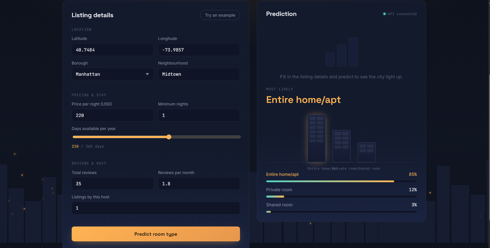
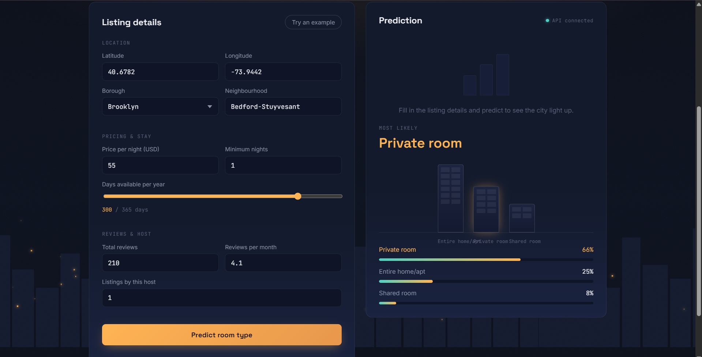
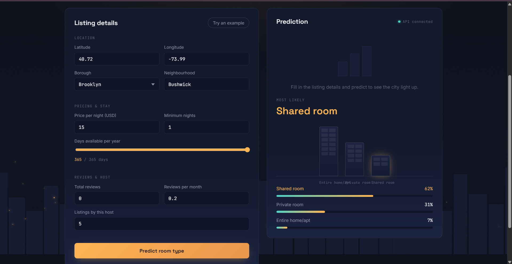

# NYC Airbnb Room Type Predictor

A FastAPI + scikit-learn app that predicts whether an Airbnb listing is an
**Entire home/apt**, **Private room**, or **Shared room**, based on listing
attributes like location, price, and review activity.

**Live demo:** https://nyc-airbnb-room-type-predictor.vercel.app/

---

## What this project demonstrates

- Full ML lifecycle: EDA → preprocessing pipeline → model comparison → hyperparameter tuning → deployment
- Honest model comparison across 4 algorithms using cross-validation, not just picking one
- Handling class imbalance (Shared Room is a small minority class) with `class_weight="balanced"`
- A single serialized `Pipeline` (preprocessing + model together) so inference needs no manual preprocessing
- A FastAPI backend with Pydantic input validation and a custom frontend

---

## Dataset

[NYC Airbnb Open Data](https://www.kaggle.com/datasets/dgomonov/new-york-city-airbnb-open-data)
(Kaggle) — 48,895 listings across NYC's five boroughs, with fields covering
location, price, minimum nights, review activity, host listing count, and
availability.

---

## Approach

**Preprocessing:** a single `ColumnTransformer` inside the pipeline —
numeric features get median imputation + standard scaling, categorical
features (borough, neighbourhood) get most-frequent imputation + one-hot
encoding. This keeps preprocessing learned only on training data, avoiding
leakage.

**Model comparison** (3-fold stratified cross-validation on the training set):

| Model | Accuracy | Macro F1 |
|---|---|---|
| Logistic Regression | 65.9% | 0.522 |
| Decision Tree | 78.2% | 0.647 |
| **Random Forest** | **85.1%** | **0.715** |
| Gradient Boosting | 85.0% | 0.705 |

Random Forest and Gradient Boosting came out close, but Random Forest was
chosen since it natively supports `class_weight="balanced"` — important
here, since Gradient Boosting in scikit-learn does not, and the minority
class (Shared Room) needed that weighting to avoid being ignored.

**Hyperparameter tuning:** `RandomizedSearchCV` over `n_estimators`,
`max_depth`, and `min_samples_split`, optimizing for macro-F1 (not plain
accuracy, since classes are imbalanced).

- Best parameters: `n_estimators=200`, `max_depth=None`, `min_samples_split=10`
- Best CV macro-F1: **0.730**

**Final test set performance** (held out, untouched until final evaluation):

- Accuracy: **85.6%**
- Macro F1: **0.741**

---

## Screenshots

### 1. Entire home/apt — high price, single-listing host
*Manhattan, Midtown — $220/night, only 1 listing by this host. The model
confidently predicts "Entire home/apt" at 85%, correctly reading price
and host scale as strong signals for a whole-place rental.*



### 2. Private room — moderate price, high review turnover
*Brooklyn, Bedford-Stuyvesant — $55/night, 4.1 reviews/month. Lower price
combined with frequent turnover is typical of a single room in someone's
home rather than a whole unit.*



### 3. Shared room — the model's hardest, rarest class
*Brooklyn, Bushwick — $15/night, 5 listings by the same host, full-year
availability, zero reviews. The model correctly identifies "Shared room,"
but with visibly lower confidence (~62%) than the other two classes. This
is an honest reflection of the data itself: Shared Room is the smallest,
most underrepresented class in the training set, so the model is
appropriately less certain here — not a bug, a real signal about data
scarcity.*



---

## API

### POST `/predict`

Predicts the room type of a listing and returns class probabilities.

**Request:**

```json
{
  "latitude": 40.7484,
  "longitude": -73.9857,
  "price": 120,
  "minimum_nights": 2,
  "number_of_reviews": 84,
  "reviews_per_month": 2.3,
  "calculated_host_listings_count": 1,
  "availability_365": 210,
  "neighbourhood_group": "Manhattan",
  "neighbourhood": "Midtown"
}
```

**Response:**

```json
{
  "Predicted_room_type": "Entire home/apt",
  "Probability": [0.85, 0.12, 0.03]
}
```

---

## Setup

```bash
git clone [your repo URL]
cd NYC-Airbnb-Room-Type-Predictor
python -m venv .venv
.venv\Scripts\Activate.ps1        # Windows
pip install -r requirements.txt
uvicorn main:app --reload --port 8000
```

Then open `index.html` in your browser (or serve it via the same FastAPI
app if configured to do so), and set `API_BASE_URL` in `script.js` to
point at your local server if testing offline.

---

## Bonus: the build pipeline, visualized

`the_build_line_guide.html` is a standalone interactive page walking
through the project's pipeline — data → ML → API → pickle → UI →
deployment — as a visual "build line," included as a way to explain the
architecture at a glance without reading the notebook.

---

## Tech stack

- **Backend:** FastAPI, scikit-learn (Pipeline + ColumnTransformer), joblib, Pydantic
- **Model:** Random Forest classifier, tuned via RandomizedSearchCV, class-weighted for imbalance
- **Frontend:** Vanilla HTML/CSS/JS
- **Dataset:** [NYC Airbnb Open Data](https://www.kaggle.com/datasets/dgomonov/new-york-city-airbnb-open-data) (Kaggle)